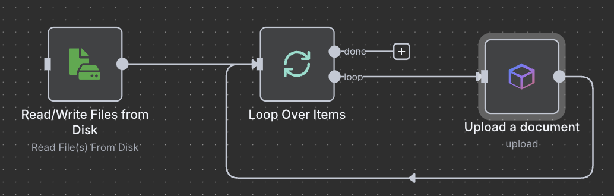
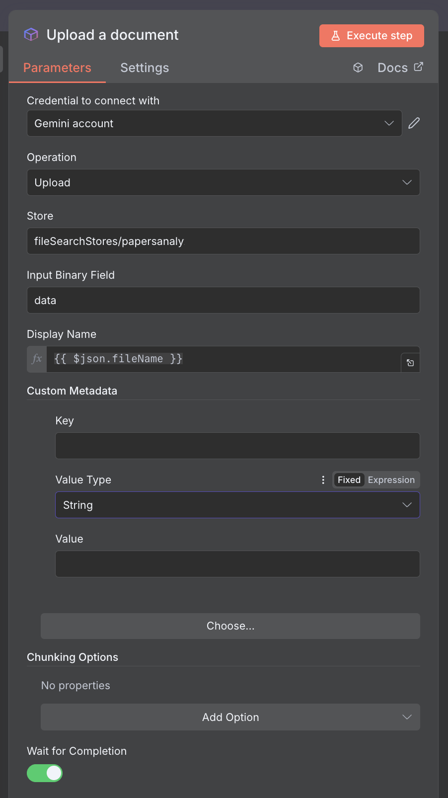
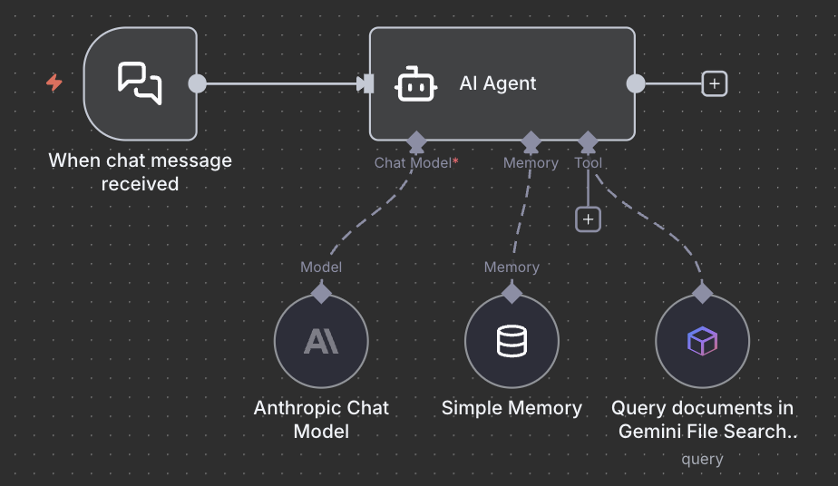
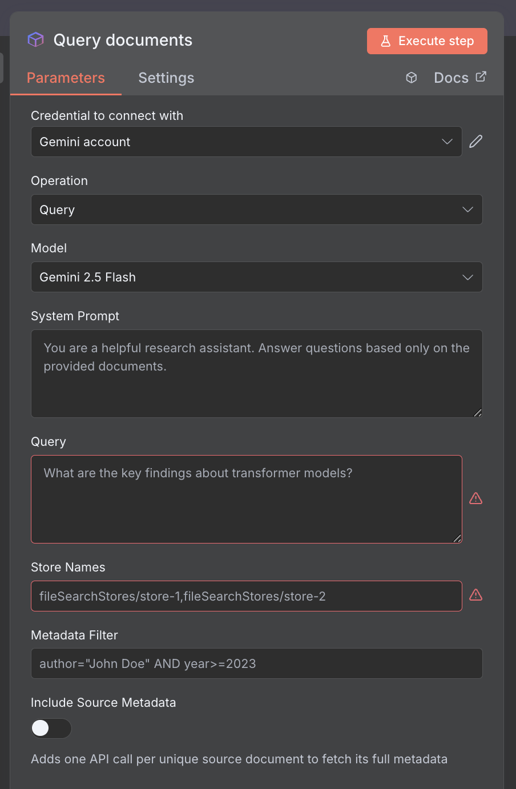
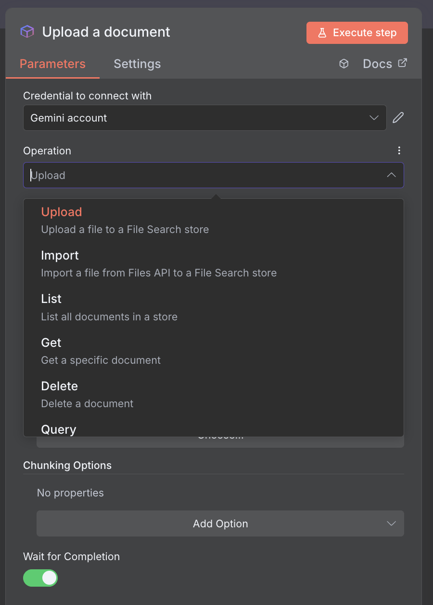
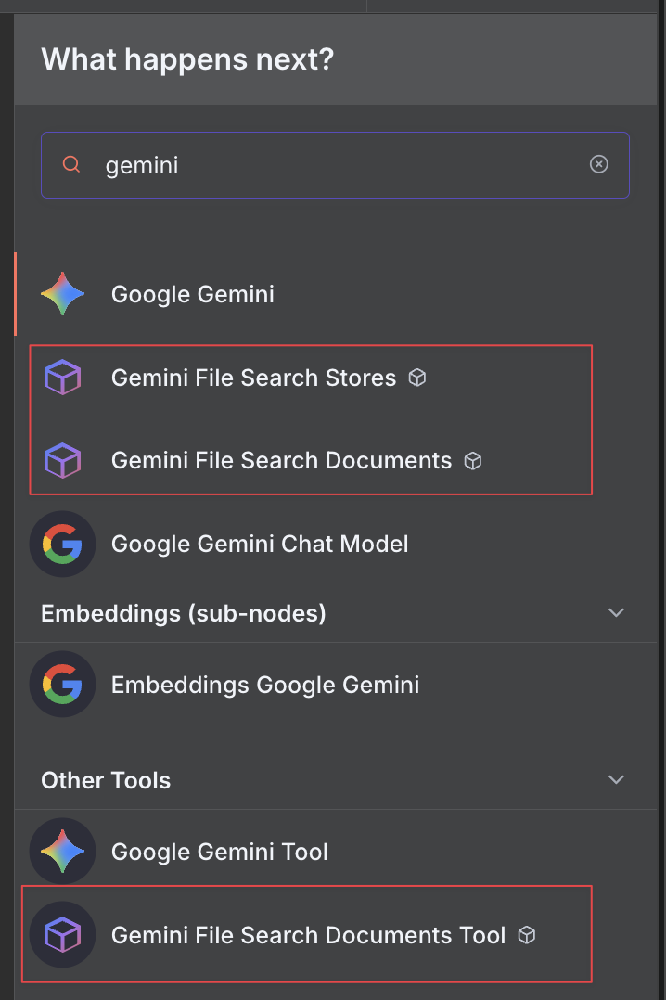

# n8n-nodes-gemini-file-search

[](https://www.npmjs.com/package/n8n-nodes-gemini-file-search)
[](https://opensource.org/licenses/MIT)
[](https://www.n8n.io)

Community nodes for integrating Google's Gemini File Search Tool API with n8n workflows. Build powerful document search and retrieval systems with AI-powered semantic search capabilities.

---

<p align="center">
  <a href="https://www.buymeacoffee.com/mbradaschia" target="_blank">
    
  </a>
</p>

<p align="center">
  <b>If you find this project helpful, consider buying me a coffee!</b>
</p>

<p align="center">
  
</p>

---

## Features

### Gemini File Search Stores Node
- **Create Stores**: Set up file search stores for document organization
- **List Stores**: View all available file search stores
- **Get Store Details**: Retrieve detailed information about specific stores
- **Delete Stores**: Remove stores (with force delete option)
- **Get Operation Status**: Monitor long-running operations

### Gemini File Search Documents Node
- **Upload Documents**: Upload files with resumable upload support (up to 100MB)
  - Binary data support from n8n workflows
  - Custom chunking configuration (chunk size, overlap)
  - Metadata attachment (up to 20 custom key-value pairs)
- **Import Documents**: Import files from Google Files API
- **List Documents**: Paginated document listing with metadata filtering
- **Get Document Details**: Retrieve specific document information
- **Delete Documents**: Remove documents from stores
- **Query Documents**: Perform RAG-based semantic search using Gemini models
  - Natural language queries with system prompts
  - Multiple model support (Gemini 2.5 Flash, Pro, Gemini 3 Pro Preview)
  - Metadata filtering (AIP-160 format)
  - Full grounding response with citations and source attribution
  - **Include Source Metadata**: Optionally fetch full document metadata for cited sources
- **Replace Upload**: Upload new document and delete old one(s) atomically
  - Match by display name, custom filename, or metadata key-value
  - Preserve and merge metadata from old document
  - Multiple merge strategies (prefer new, prefer old, merge all)

## Installation

### From npm

```bash
npm install n8n-nodes-gemini-file-search
```

### In n8n

1. Go to **Settings** > **Community Nodes**
2. Select **Install**
3. Enter `n8n-nodes-gemini-file-search` in the search bar
4. Click **Install**

### From source

```bash
# Clone the repository
git clone https://github.com/mbradaschia/unofficial-n8n-gemini-file-search-tool.git
cd unofficial-n8n-gemini-file-search-tool

# Install dependencies
npm install

# Build the nodes
npm run build

# Link to your n8n installation
npm link
cd ~/.n8n/nodes
npm link n8n-nodes-gemini-file-search
```

## Some screenshots

### Easly upload documents to Gemini File Search Stores

**No complex embeddings, vector stores, etc. Just create a store using the Store node and upload your docs as they are!**

Use case examples:

- Track files in your folders and upload when added/changed
- Track your Obsidian folder to create your PKM, using metadata
- Upload invoices, contracts, reports to create a company knowledge base
- Upload research papers, articles, books to create a personal library
- And many more...

<p align="center">
    
</p>

<p align="center">
    
</p>


### Easily query your documents with Gemini RAG capabilities
**No complex retrieval systems, vector searches, etc. Just query your documents from the File Store using Gemini models!**

<p align="center">
  
</p>

<p align="center">
  
</p>


### Easily manage documents
**Upload, delete, replace/upload documents**

<p align="center">
  
</p>

### File Store node, Document node and Document tools

<p align="center">
  
</p>


## Quick Start

For detailed instructions, see the <b>[Building a Knowledge Base Tutorial](docs/tutorials/building-a-knowledge-base.md)</b>.

<a href="/docs/nodes/gemini-file-search-stores.md" target="_blank">
>> <b>GEMINI FILE STORE NODE DOCUMENTATION</b>
</a>
<br/>
<a href="/docs/nodes/gemini-file-search-documents.md" target="_blank">
>> <b>GEMINI FILE SEARCH DOCUMENT NODE DOCUMENTATION</b>
</a>


### 1. Set Up Credentials

1. Get a Gemini API key from [Google AI Studio](https://makersuite.google.com/app/apikey)
2. In n8n, create a new **Gemini API** credential
3. Enter your API key

### 2. Create a File Search Store

Add the **Gemini File Search Stores** node to your workflow:
- **Operation**: Create Store
- **Display Name**: "My Document Store"

### 3. Upload Documents

Add the **Gemini File Search Documents** node:
- **Operation**: Upload Document
- **Store Name**: (output from step 2)
- **Binary Property**: Select your file input
- **Custom Metadata** (optional): Add key-value pairs for filtering

### 4. Query Documents

Add another **Gemini File Search Documents** node:
- **Operation**: Query Documents
- **Model**: Gemini 2.5 Flash (or Pro for complex queries)
- **Store Names**: (comma-separated list of stores to search)
- **Query**: "What is the main topic discussed?"
- **Include Source Metadata**: Enable to get full document details with citations

## Query Response Structure

The Query operation uses Gemini's RAG (Retrieval-Augmented Generation) capabilities. The response includes:

```javascript
{
  "candidates": [{
    "content": {
      "parts": [{ "text": "The AI-generated answer..." }]
    },
    "groundingMetadata": {
      "groundingChunks": [{
        "retrievedContext": {
          "title": "Document Name",
          "text": "Relevant chunk content...",
          "fileSearchStore": "fileSearchStores/store-id",
          // When "Include Source Metadata" is enabled:
          "documentMetadata": {
            "name": "fileSearchStores/store-id/documents/doc-id",
            "displayName": "Document Name",
            "customMetadata": [
              { "key": "author", "stringValue": "John Doe" },
              { "key": "version", "numericValue": 2.0 }
            ],
            "state": "STATE_ACTIVE",
            "mimeType": "application/pdf"
          }
        }
      }],
      "groundingSupports": [{
        "segment": { "text": "cited text segment" },
        "groundingChunkIndices": [0],
        "confidenceScores": [0.95]
      }]
    }
  }],
  "usageMetadata": {
    "totalTokenCount": 1500
  }
}
```

### Accessing Response Data in n8n

- **Answer**: `$json.candidates[0].content.parts[0].text`
- **Source Documents**: `$json.candidates[0].groundingMetadata.groundingChunks`
- **Citations**: `$json.candidates[0].groundingMetadata.groundingSupports`
- **Document Metadata**: `$json.candidates[0].groundingMetadata.groundingChunks[0].retrievedContext.documentMetadata`
- **Token Usage**: `$json.usageMetadata.totalTokenCount`

## Configuration

### Chunking Configuration

When uploading documents, you can customize how documents are split:

- **Max Tokens Per Chunk**: Number of tokens per chunk (default: 200)
- **Max Overlap Tokens**: Number of overlapping tokens between chunks (default: 20)

### Custom Metadata

Documents support up to 20 custom metadata key-value pairs with three value types:
- **String**: Text values
- **Number**: Numeric values
- **String List**: Comma-separated list of values

### Metadata Filtering

Metadata filtering follows the [AIP-160 format](https://google.aip.dev/160):

**Examples:**
```
author="John Doe"
category="financial" AND year>=2024
status="active" OR priority="high"
tags:*="urgent"
```

**Supported Operators:**
- `=`: Equals
- `!=`: Not equals
- `>`, `<`, `>=`, `<=`: Comparisons
- `AND`, `OR`, `NOT`: Logical operators
- `:*=`: Array contains

## Replace Upload Operation

The Replace Upload operation provides an atomic way to update documents (workaround for API limitation that doesn't support direct updates):

### Match Options
- **None (Upload Only)**: Just upload without deleting any existing documents
- **Display Name**: Find and delete documents matching the new document's display name
- **Custom Filename**: Specify a different filename to match against
- **Metadata Key-Value**: Match documents by a specific metadata field

### Metadata Preservation
When replacing documents, you can preserve metadata from the old document:
- **Prefer New**: New metadata overrides old values for same keys
- **Prefer Old**: Old metadata kept, new values only fill gaps
- **Merge All**: All unique keys from both old and new are included
- **Use Old Only**: Only use old metadata, ignore new

## Documentation

- **[Project Structure](docs/PROJECT_STRUCTURE.md)**: Overview of codebase organization
- **[API Reference](docs/refs/gemini/)**: Gemini API documentation
  - [File Search Stores](docs/refs/gemini/file-search-stores.md)
  - [Documents](docs/refs/gemini/document.md)
- **[Development Guide](docs/specs/)**: Implementation plans and guides

## API Limits

- **File Size**: Up to 100MB per file
- **Metadata**: Up to 20 custom key-value pairs per document
- **Display Name**: Up to 512 characters
- **Store Limit**: Check your Gemini API quota
- **Rate Limits**: Subject to Gemini API rate limits

## Troubleshooting

### Upload Fails for Large Files

**Solution**: Files automatically use resumable upload. Ensure your n8n instance has adequate timeout settings.

### Metadata Filter Not Working

**Solution**: Verify your filter follows AIP-160 format. Use `=` for exact matches and ensure proper quoting for string values.

### Query Returns No Results

**Solution**:
- Verify documents are uploaded and indexed (check operation status)
- Try broader queries
- Check metadata filters aren't too restrictive

### Custom Metadata Not in Query Response

**Solution**: Enable "Include Source Metadata" option in the Query operation. This adds API calls to fetch full document details for each cited source.

### Null Value Errors in Metadata

**Solution**: The node automatically filters out null/empty metadata values. If using n8n expressions that may return null, they will be safely ignored.

## Development

### Prerequisites

- Node.js >=18.0.0
- npm or yarn
- n8n installed (for testing)

### Setup

```bash
# Install dependencies
npm install

# Run tests
npm test

# Run tests with coverage
npm run test:coverage

# Build
npm run build

# Lint
npm run lint

# Format code
npm run format
```

### Project Structure

```
.
├── nodes/                     # Node implementations
│   ├── GeminiFileSearchStores/
│   │   ├── GeminiFileSearchStores.node.ts
│   │   ├── descriptions/
│   │   └── operations/
│   └── GeminiFileSearchDocuments/
│       ├── GeminiFileSearchDocuments.node.ts
│       ├── descriptions/
│       └── operations/
├── credentials/               # Credential definitions
│   └── GeminiApi.credentials.ts
├── utils/                     # Shared utilities
│   ├── apiClient.ts          # API request helpers
│   ├── validators.ts         # Input validation
│   ├── metadataFilter.ts     # AIP-160 filter parsing
│   └── types.ts              # TypeScript interfaces
├── test/                      # Test suites
│   ├── unit/
│   ├── integration/
│   └── e2e/
└── docs/                      # Documentation
```

See [docs/PROJECT_STRUCTURE.md](docs/PROJECT_STRUCTURE.md) for complete structure.

## Contributing

Contributions are welcome! Please follow these guidelines:

1. Fork the repository
2. Create a feature branch: `git checkout -b feature/my-feature`
3. Make your changes
4. Add tests for new functionality
5. Ensure all tests pass: `npm test`
6. Commit with conventional commits: `git commit -m "feat: add new feature"`
7. Push to your fork: `git push origin feature/my-feature`
8. Open a pull request

## Testing

This project maintains high test coverage:

```bash
# Run all tests
npm test

# Unit tests only
npm run test:unit

# Coverage report
npm run test:coverage
```

## License

[MIT License](LICENSE)

Copyright (c) 2025 Brada

## Support

- **Issues**: [GitHub Issues](https://github.com/mbradaschia/unofficial-n8n-gemini-file-search-tool/issues)
- **Documentation**: [docs/](docs/)
- **n8n Community**: [community.n8n.io](https://community.n8n.io)

---

<p align="center">
  <a href="https://www.buymeacoffee.com/mbradaschia" target="_blank">
    
  </a>
</p>

---

## Acknowledgments

- Built for [n8n](https://n8n.io) workflow automation
- Powered by [Google Gemini API](https://ai.google.dev/gemini-api)
- Implements [AIP-160](https://google.aip.dev/160) filtering standard

## Related Projects

- [n8n](https://github.com/n8n-io/n8n) - Workflow automation platform
- [n8n-nodes-starter](https://github.com/n8n-io/n8n-nodes-starter) - Template for n8n nodes

---

Made with ❤️ for the n8n community

